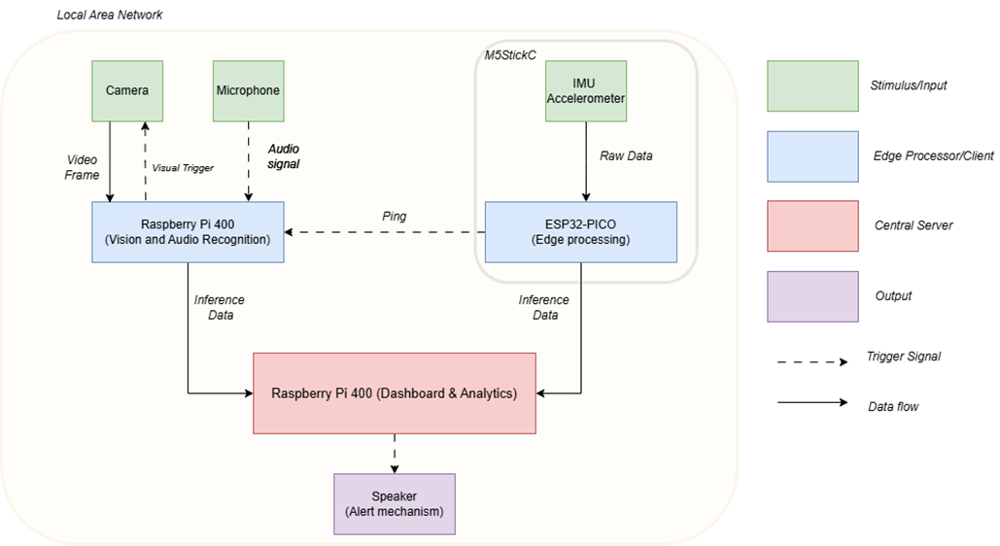

# DontFall

DontFall is an Edge Computing and Analytics project. The project aims to run real-time Fall Detection using stimulus from a camera, an MPU 6050 accelerometer and a microphone. The project is designed to run on a Raspberry Pi 400.



## Installation

Clone the repository and navigate to the project directory. Install requirements using pip:

```bash
pip install -r requirements.txt
```

## Usage

All edge devices should be connected to one access point (i.e your mobile hotspot or router)

Run the accelerometer code by uploading the code found in `accelerometer` folder into the M5Stick C Plus.

Run the camera and microphone code by running the `main.py` file in the `vision` folder into one Raspberry Pi 400 connected to the camera.

Run the dashboard code by running the `main.py` file in the `root` folder into another Raspberry Pi 400.

